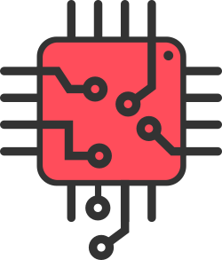
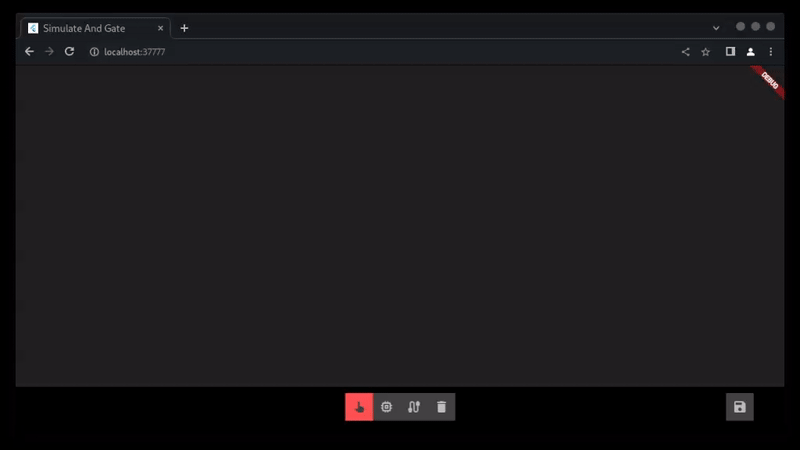

    

<h1 align="center">Logic Builder</h1>

Friendly 👋 and lightweight 🚀 tool 🔬 to Design digital logic circuits 🧮

 

## 🤔 What's is Logic Builder?  

Logic Builder is a user-friendly and lightweight tool designed to facilitate the creation of digital logic circuits. Tailored for ease of use, this intuitive platform empowers both beginners and experienced users to design intricate digital logic systems with efficiency and precision. The tool's user interface prioritizes accessibility, allowing individuals with varying levels of expertise to seamlessly navigate the process of building circuits.

Whether you're a novice exploring the fundamentals of digital logic or an experienced designer seeking a streamlined solution, Logic Builder offers a versatile environment for constructing circuits. Its friendly interface welcomes users into the world of digital logic, providing a hassle-free experience for designing, testing, and refining circuits. With Logic Builder, the intricate process of creating digital logic circuits becomes a straightforward and enjoyable endeavor, making it an invaluable asset for anyone engaged in the realm of digital electronics.
   

